# 🌿 CropGuardian AI - Complete Technical, Architectural, and Developer Documentation

**CropGuardian AI** is an intelligent, production-ready, multi-agent agricultural system built using Google's Agent Development Kit (ADK) and Streamlit. It assists farmers and agronomists in detecting crop diseases, assessing environmental risks, and generating actionable agricultural advice. It integrates a computer vision pipeline (MobileNetV2 CNN) with environmental intelligence and an optimized O(1) Knowledge Base retrieval layer, backed by Google's Gemini LLM.

---

# 1. Project Overview

### Problem Statement
Farmers worldwide face significant crop yield losses due to diseases. Traditional diagnostics are slow, expensive, and require specialized agronomist visits. Furthermore, simple disease identification is not enough; farmers need weather-aware, localized advice, risk of infection propagation assessments, and immediate action plans.

### Objectives
* Provide rapid, mobile-accessible leaf disease identification.
* Compute environmental propagation risk in real time.
* Generate context-rich, weather-aware treatment and prevention strategies.
* Implement a dual-orchestration layer for reliable execution.
* Ensure a continuous feedback loop for active learning and dataset collection.

### Proposed Solution
CropGuardian AI offers an end-to-end multi-agent pipeline:
1. **Visual Classification**: MobileNetV2 CNN identifies the crop and disease.
2. **Knowledge Injection**: Immediate lookup in a validated database for scientific context.
3. **Weather Intelligence**: Geocoding and API forecasting query.
4. **Logic Calculations**: Severity classification and climate-driven spread analysis.
5. **Generative Recommendation**: Synthesis of context into a structured JSON advice report via Gemini.
6. **Active Feedback Loop**: Manual correction tracking.

### Key Features
* **Dual-Orchestration Engine**: Google ADK router with fallback to Python legacy sequencer.
* **O(1) Knowledge Cache**: Thread-safe cache loaded and validated at boot time.
* **Geocoded Climate Integration**: Supports address strings or direct latitude/longitude coordinate calls.
* **Traceable Context Logs**: ContextVars propagate session and correlation IDs across all files.

### Technology Stack
* **Frontend UI**: Streamlit v1.35+
* **Deep Learning Framework**: TensorFlow v2.15+ (MobileNetV2 CNN)
* **LLM Engine**: Google Gemini API (`gemini-2.5-flash`, `google-genai` SDK)
* **Agent Framework**: Google Agent Development Kit (ADK)
* **Weather API**: Open-Meteo & OpenStreetMap Nominatim API
* **Data Layer**: Local JSON Knowledge Base & CSV storage

### System Requirements
* **Minimum**: CPU (Intel i5/Ryzen 5), 8GB RAM, Windows/Linux/macOS, Python 3.11
* **Recommended**: GPU (NVIDIA GTX/RTX), 16GB RAM, Dedicated CUDA environment

### Project Scope
Applies to 14 crop species across 38 class labels.

---

# 2. High-Level Architecture

### System Architecture Diagram
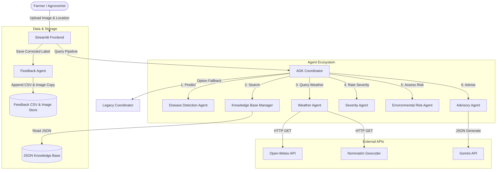

### Layered Architecture Diagram
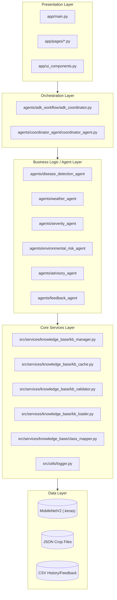

### Component Diagram
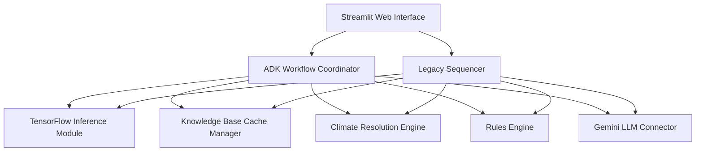

### Deployment Diagram
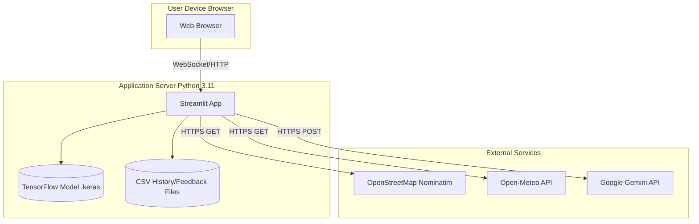

### Package Diagram
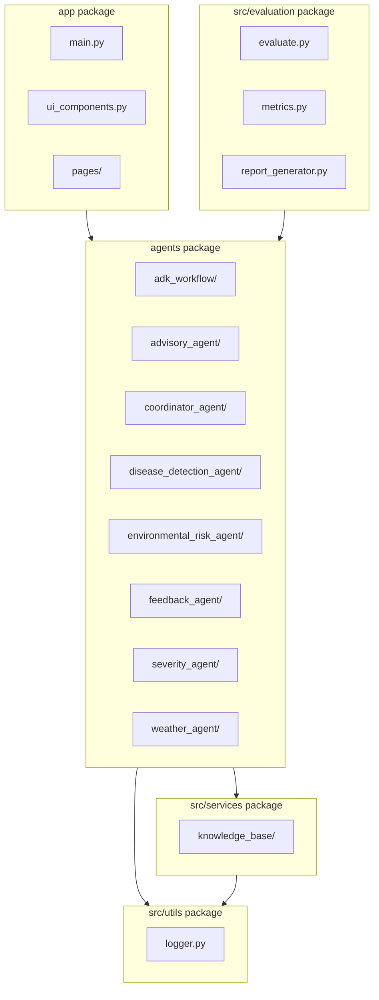


### Dependency Graph
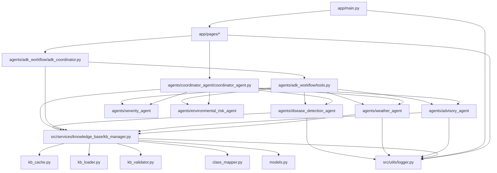

---

# 3. Project Directory Structure

```text
agricare/
├── agents/                     # Multi-Agent ecosystem
│   ├── adk_workflow/           # Google ADK orchestration & ADK tools
│   ├── advisory_agent/         # LLM Advisory generation module
│   ├── coordinator_agent/      # Legacy sequential orchestrator
│   ├── disease_detection_agent/# CNN prediction module
│   ├── environmental_risk_agent/# Risk assessment logic
│   ├── feedback_agent/         # Active learning feedback loop
│   ├── severity_agent/         # Severity scoring module
│   └── weather_agent/          # Weather API integrations
├── app/                        # Streamlit Web Application
│   ├── main.py                 # App entry point & startup validation
│   ├── pages/                  # Streamlit UI pages
│   ├── ui/                     # Modular design components (styles, headers, sidebars, cards)
│   └── utils/                  # Shared business utilities (crop inference, normalization)
├── data/                       # Local data storage (history, feedback, retraining)
├── diagrams/                   # Architecture diagrams
├── knowledge_base/             # JSON schemas and validated disease data
├── logs/                       # Application logs (structured contextual logging)
├── models/                     # Trained ML models (.keras) and class mappings
├── notes/                      # Technical documentation and walkthroughs
├── src/                        # Core source code
│   ├── evaluation/             # Model evaluation and metrics scripts
│   ├── services/               # System services
│   │   └── knowledge_base/     # Retrieval layer, Cache, Manager, Models
│   └── utils/                  # Shared utilities (logger.py)
├── temp/                       # Temporary directories (uploads, cache)
├── tests/                      # Unit and integration test suite
└── requirements.txt            # Python dependencies
```

### Folder Explanations
* **`agents/`**: Contains the code for all active agents. Responsibilities: encapsulates specific capabilities (e.g., geocoding, image parsing). Dependencies: relies on `src/services` and `src/utils/logger.py`.
* **`app/`**: Contains the user interface presentation layer. Responsibilities: renders screens, uploads images, queries coordinators. Dependencies: imports from `agents` and `app/ui_components.py`.
* **`src/services/knowledge_base/`**: Retrieval service. Responsibilities: Startup schema verification, O(1) memory lookup, case-insensitive mapping. Dependencies: Pydantic, YAML parser, Python thread `RLock`.
* **`src/utils/`**: Shared tools. Responsibilities: logging, ContextVars execution tracing, temporary file cleanup.
* **`src/evaluation/`**: Performance testing. Responsibilities: reads datasets, triggers classification tests, reports confusion metrics.

---

# 4. File-by-File Documentation

## 4.1. File: `app/main.py`
* **Purpose**: Entry point of the Streamlit application.
* **Description**: Sets page configuration, imports styling parameters, starts background cleanup tasks, instantiates `KnowledgeBaseManager`, and prints the landing page.
* **Dependencies**: Streamlit, Pydantic, YAML.
* **Imports**: `src.utils.logger`, `src.services.knowledge_base.kb_manager`, `ui_components`.
* **Exports**: None.
* **Used By**: Executed by `streamlit run app/main.py`.
* **Why This File Exists**: Initializes the web app and checks the health of the JSON Knowledge Base at startup.
* **What Happens If Removed**: Users cannot launch the application frontend, and startup setup tasks are not executed.
* **Alternative / Improvements**: Add user login auth, multithreaded warming.
* **Call Graph**:
  `main` -> `log_environment_snapshot` -> `cleanup_temp_files` -> `KnowledgeBaseManager` initialization.

## 4.2. File: `app/ui_components.py`
* **Purpose**: Shared styling and page styling utilities.
* **Description**: Renders HTML/CSS stylings into Streamlit to match dark-mode palettes, and formats text components.
* **Imports**: Streamlit, JSON.
* **Exports**: `inject_css`, `render_badge`, `render_section_label`, `render_prediction_summary`, `KnowledgeBasePresentationEngine`.
* **Used By**: `app/main.py`, `app/pages/*.py`.
* **Why This File Exists**: Separates CSS injection and custom presentation code from layout code.
* **What Happens If Removed**: The app UI falls back to standard Streamlit layouts with no custom styling.

## 4.3. File: `app/pages/1_Disease_Detection.py`
* **Purpose**: The main disease diagnostic feature.
* **Description**: Handles file uploads, retrieves farm coordinates or text addresses, executes the selected coordinator (ADK vs Legacy), logs records, and displays the report.
* **Imports**: Streamlit, PIL, `ADKCoordinatorAgent`, `CoordinatorAgent`, `FeedbackAgent`, `logger`.
* **Why This File Exists**: Contains the UI elements and state updates for the diagnostic pipeline.
* **What Happens If Removed**: Users cannot run crop diagnostics.
* **Workflow**:
  `Upload leaf` -> `Fetch user loc` -> `Run Coordinator` -> `Display results` -> `User Correction Form`.

## 4.4. File: `app/pages/5_CropGuardian_AI_Assistant.py`
* **Purpose**: Chatbot interface page.
* **Description**: Uses diagnosis variables stored in `st.session_state["chat_context"]` to prompt Gemini. Maintains user session history.
* **Imports**: Streamlit, `AdvisoryAgent`, JSON.
* **Why This File Exists**: Provides a conversational assistant for users to ask follow-up questions about their diagnosis.
* **What Happens If Removed**: Users lose the chatbot assistant.

## 4.5. File: `agents/adk_workflow/adk_coordinator.py`
* **Purpose**: Orchestrator using the Google Agent Development Kit.
* **Description**: Instantiates Gemini-powered agents, defines their roles, builds the `AdvisoryState` Pydantic model, and runs the workflow. Falls back to `CoordinatorAgent` if gRPC API keys are missing.
* **Imports**: `google.adk.Agent`, `AdvisoryState`, `CoordinatorAgent`, tools.
* **Used By**: `1_Disease_Detection.py`.
* **Why This File Exists**: Handles the ADK-based multi-agent execution pipeline.
* **What Happens If Removed**: The ADK pipeline becomes unavailable, forcing the system to rely only on the legacy orchestrator.

## 4.6. File: `agents/adk_workflow/tools.py`
* **Purpose**: Tool bindings for ADK agents.
* **Description**: Adapts legacy python agent methods to be compatible with ADK tool routing.
* **Imports**: `DiseaseDetectionAgent`, `WeatherAgent`, `SeverityAgent`, `EnvironmentalRiskAgent`, `AdvisoryAgent`.
* **Used By**: `adk_coordinator.py`.

## 4.7. File: `agents/disease_detection_agent/disease_detection_agent.py`
* **Purpose**: Computer Vision (CV) model inference.
* **Description**: Loads the MobileNetV2 model and class names. Performs image preprocessing and outputs the top 3 predictions.
* **Imports**: TensorFlow, NumPy, hashlib.
* **Used By**: `tools.py`, `coordinator_agent.py`.
* **Why This File Exists**: Separates image preprocessing and CNN execution from routing logic.
* **What Happens If Removed**: Crop disease predictions cannot be generated.

## 4.8. File: `agents/weather_agent/weather_agent.py`
* **Purpose**: Geocoding and weather data retrieval.
* **Description**: Resolves addresses using OpenStreetMap Nominatim, calls Open-Meteo for local coordinates, and handles caching (15-minute TTL) and API retries.
* **Imports**: Requests, Cache tools.
* **Used By**: `tools.py`, `coordinator_agent.py`.
* **Why This File Exists**: Encapsulates external weather API calls, retries, and caching.

## 4.9. File: `agents/environmental_risk_agent/environmental_risk_agent.py`
* **Purpose**: Fungal, bacterial, and heat stress propagation threat analysis.
* **Description**: Uses deterministic rules based on weather conditions (humidity, temperature, rain) to calculate the spread probability of a disease.
* **Imports**: Logging tools.
* **Used By**: `tools.py`, `coordinator_agent.py`.
* **Why This File Exists**: Determines if local weather conditions are favorable for disease propagation.

## 4.10. File: `agents/severity_agent/severity_agent.py`
* **Purpose**: Disease infection damage assessment.
* **Description**: Uses confidence thresholds to determine infection severity (Low, Medium, High).
* **Imports**: Logging.
* **Used By**: `tools.py`, `coordinator_agent.py`.

## 4.11. File: `agents/advisory_agent/advisory_agent.py`
* **Purpose**: Generates treatment and prevention advice.
* **Description**: Calls the Gemini API with structured JSON output parameters. Falls back to local database records if the API is offline.
* **Imports**: `google.genai`, Pydantic models.
* **Used By**: `tools.py`, `coordinator_agent.py`.

## 4.12. File: `agents/feedback_agent/feedback_agent.py`
* **Purpose**: Saves user corrections.
* **Description**: Computes the MD5 hash of an image, copies it to `data/feedback/images/<md5>.jpg` (ignoring duplicates), and logs the correct label and metadata to a CSV file.
* **Imports**: CSV, MD5 tools.
* **Used By**: `1_Disease_Detection.py`, `2_Feedback.py`.

## 4.13. File: `agents/coordinator_agent/coordinator_agent.py`
* **Purpose**: Sequential pipeline coordinator.
* **Description**: Executes agent steps sequentially. Handles failures gracefully so the pipeline can continue even if individual agents fail (Partial Success).
* **Imports**: `DiseaseDetectionAgent`, `WeatherAgent`, `SeverityAgent`, `EnvironmentalRiskAgent`, `AdvisoryAgent`.

## 4.14. File: `src/utils/logger.py`
* **Purpose**: Contextual logging and tracing.
* **Description**: Formats logs with `SessionID`, `CorrelationID`, and `RunID` using ContextVars. Configures log rotation and handles temporary file cleanups.
* **Imports**: Logging, `contextvars`, `RotatingFileHandler`.

## 4.15. File: `src/services/knowledge_base/class_mapper.py`
* **Purpose**: Class name resolution.
* **Description**: Matches raw CNN output classes to canonical database keys using a 4-stage resolution strategy (Exact -> Case-Insensitive -> Explicit Mapping -> Not Found).
* **Imports**: dataclasses.

## 4.16. File: `src/services/knowledge_base/kb_cache.py`
* **Purpose**: In-memory database cache.
* **Description**: Stores parsed Pydantic objects. Uses thread locks (`RLock`) to prevent race conditions during updates.
* **Imports**: Threading, Pydantic records.

## 4.17. File: `src/services/knowledge_base/kb_loader.py`
* **Purpose**: Reads JSON and YAML files from disk.
* **Description**: Reads `knowledge_base_config.yaml` and crop JSON files.
* **Imports**: Pathlib, PyYAML, JSON.

## 4.18. File: `src/services/knowledge_base/kb_manager.py`
* **Purpose**: Main interface for the Knowledge Base.
* **Description**: Coordinates loading, validation, caching, and mapping at startup and during queries.
* **Imports**: `ClassMapper`, `KnowledgeBaseCache`, `KnowledgeBaseLoader`, `KnowledgeBaseValidator`.

## 4.19. File: `src/services/knowledge_base/kb_validator.py`
* **Purpose**: Pydantic and JSON validation.
* **Description**: Validates loaded data against structural schemas, logging any issues found.
* **Imports**: Pydantic.

## 4.20. File: `src/services/knowledge_base/models.py`
* **Purpose**: Schemas and Pydantic models.
* **Description**: Defines Pydantic models for disease records and the advisory context.

## 4.21. File: `src/evaluation/evaluate.py`
* **Purpose**: Runs model evaluation metrics on test datasets.
* **Description**: Classifies images in directory paths, computes metrics, and generates a model health report.
* **Imports**: Scikit-Learn.

## 4.22. File: `app/utils/crop_utils.py`
* **Purpose**: Shared business utility for crop name inference and normalization.
* **Description**: Extracts and normalizes crop names from raw identifiers (e.g. `Tomato___Late_blight` -> `Tomato`, `Pepper,_bell___Bacterial_spot` -> `Pepper Bell`) and formatted strings. Used as a single source of truth across coordinators and UI pages.
* **Imports**: None.
* **Used By**: `CoordinatorAgent`, `ADKCoordinatorAgent`, `1_Disease_Detection.py`, `5_CropGuardian_AI_Assistant.py`.

## 4.23. Directory: `app/ui/`
* **Purpose**: Modular presentation components package.
* **Description**: Contains UI modules (styles, headers, sidebar, cards, advisory tabs, system health telemetry) to decouple backend coordinator logic from presentation aesthetics.
* **Imports**: Streamlit, platform, psutil.

---

# 5. End-to-End System Execution Flow

### Execution Sequence
```text
Application Startup
  ├─ Load environment variables
  ├─ Initialize logs & clear old temp files
  └─ Warm Knowledge Base Cache (validate JSON schema -> parse to Pydantic)
Streamlit Main Page
  └─ User uploads leaf image and inputs farm location
Diagnosis Page
  ├─ Initialize session ContextVars (SessionID, RunID, CorrelationID)
  ├─ Invoke Coordinator (ADK Workflow / Legacy Sequencer)
  │    ├─ Step 1: Preprocess image & run MobileNetV2 (disease detection)
  │    ├─ Step 2: Map output class name to canonical KB key
  │    ├─ Step 3: Fetch weather data (geocoding & API forecast query)
  │    ├─ Step 4: Determine severity based on prediction confidence
  │    ├─ Step 5: Assess environmental spread risk using weather conditions
  │    └─ Step 6: Generate advisory report (Gemini API query / local fallback)
  ├─ Append record to prediction history CSV
  └─ Display diagnostic report on Streamlit UI
Chatbot assistant
  └─ Load active diagnosis variables and prompt Gemini for follow-up answers
```

### Sequence Diagram
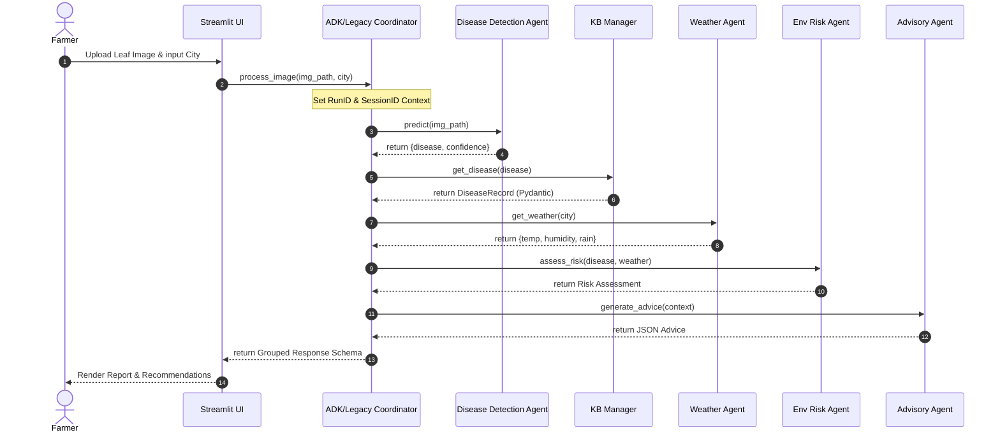

### Activity Diagram
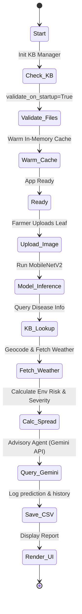

### Data Flow Diagram (DFD - Level 1)
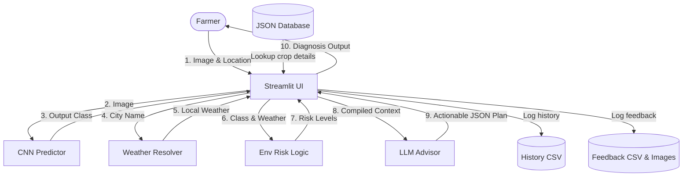

---

# 6. Agent Architecture Documentation

CropGuardian AI uses a multi-agent architecture with 8 specialized agents to handle distinct tasks:

| Agent Name | Primary Purpose | Inputs | Outputs | External APIs Used |
| :--- | :--- | :--- | :--- | :--- |
| **Disease Detection Agent** | Classifies leaf diseases | Image path | Disease class, confidence | TensorFlow, NumPy |
| **Weather Agent** | Resolves location & fetches weather | City or Lat/Lon | Temperature, humidity, rain | Open-Meteo, OpenStreetMap |
| **Risk Assessment Agent** | Evaluates spread likelihood | Disease class, weather | Overall risk, fungal/bacterial risk | Deterministic python rules |
| **Severity Agent** | Assesses infection severity | Confidence, disease class | Severity score (Low, Med, High) | Deterministic confidence rules |
| **Advisory Agent** | Generates recommendations | AdvisoryContext | JSON treatment plan | Google Gemini API |
| **Feedback Agent** | Saves corrections and image copies | Original path, correct label | CSV entry, saved image | Local storage, MD5 |
| **Coordinator Agent** | Legacy sequential pipeline | Image, location | Grouped response | Internal python objects |
| **ADK Coordinator** | ADK-based agent orchestration | Image, location | Grouped response | Google ADK, Gemini Routing |

---

### 6.1. Disease Detection Agent
* **Purpose**: Classifies leaf images using a trained model.
* **Internal Workflow**: Resizes images to $224 \times 224$ pixels, normalizes values between -1 and 1, runs the MobileNetV2 model, and sorts the top 3 classes.
* **Error Handling**: Catches image reading errors and model inference exceptions, returning a default dictionary with the error message.
* **Design Decisions**: Chosen for its lightweight structure, making it fast and suitable for running on standard CPU servers.

### 6.2. Weather Agent
* **Purpose**: Fetches real-time weather conditions for a farm.
* **Internal Workflow**: Normalizes inputs, runs Nominatim geocoding (with India as the preferred country fallback), and queries Open-Meteo. Uses a 15-minute cache TTL.
* **Error Handling**: Catches connection timeouts and network errors. Returns a structured JSON dictionary with status `unavailable` to prevent pipeline crashes.

### 6.3. Environmental Risk Agent
* **Purpose**: Evaluates how weather affects disease spread.
* **Internal Workflow**: Compares humidity and temperature ranges to calculate fungal risk (humidity > 70%), bacterial risk (humidity > 80% & temp between 25-35°C), and heat stress. Aggregates these values to determine the spread probability.

### 6.4. Severity Agent
* **Purpose**: Rates the severity of the infection.
* **Internal Workflow**: Uses confidence thresholds as a proxy for severity (High for conf >= 90.0, Medium for conf >= 70.0, Low otherwise, and None for healthy classes).
* **Limitations**: Relies on model confidence. Future versions can use direct computer vision segmentation to measure spot surface area.

### 6.5. Advisory Agent
* **Purpose**: Generates treatment and prevention advice.
* **Internal Workflow**: Gathers weather, risk, and Knowledge Base context into an `AdvisoryContext` object, formats a system prompt, queries the Gemini API with structured JSON output parameters, and parses the response.
* **Recovery Mechanism**: Falls back to local, hand-written crop advisory records if the Gemini API is offline or the rate limit is exceeded.

### 6.6. Feedback Agent
* **Purpose**: Saves user corrections.
* **Internal Workflow**: Computes the MD5 hash of an image, copies it to `data/feedback/images/<md5>.jpg` (ignoring duplicates), and logs the correct label and metadata to a CSV file.

### 6.7. Coordinator Agent (Legacy)
* **Purpose**: Sequential pipeline coordinator.
* **Internal Workflow**: Runs each agent step sequentially. Catches exceptions at each stage, appending warnings to the diagnostics payload to ensure the process completes.

### 6.8. ADK Coordinator Agent
* **Purpose**: Orchestrates agents using Google's ADK.
* **Internal Workflow**: Sets up ADK Agents using `gemini-2.5-flash` with tool call bindings.
* **Fallback**: Automatically redirects to `CoordinatorAgent` if the `google-adk` package is missing or the Gemini API key is not configured.

---

### Agent Communication Diagram
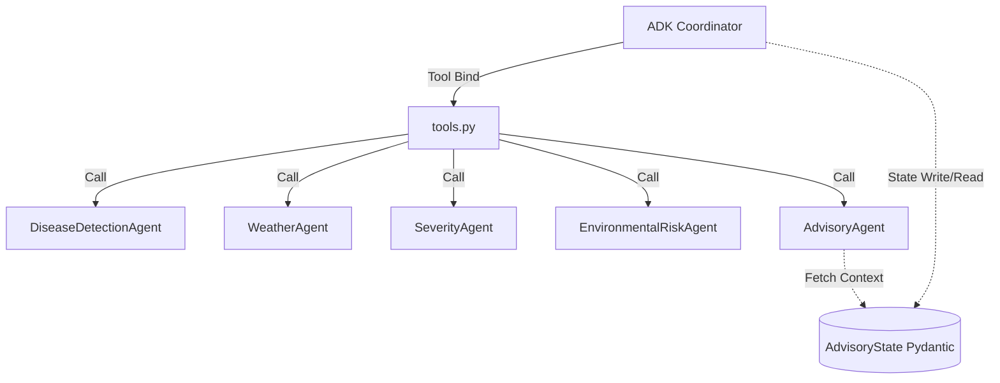

---

# 7. Agent Communication and Orchestration

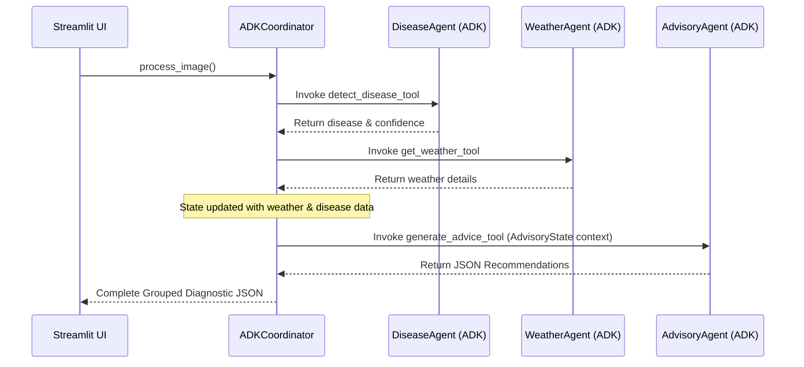

---

# 8. Chatbot Architecture

The **CropGuardian AI Assistant** provides a context-aware chatbot using the diagnosis variables stored in Streamlit's session state.

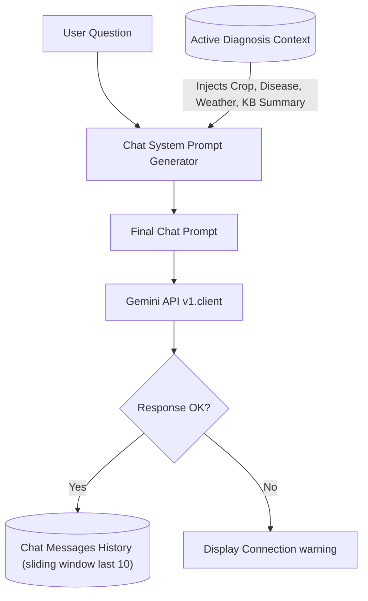

### Context Construction Prompt Structure
```text
SYSTEM INSTRUCTION:
You are CropGuardian AI, a context-aware agricultural AI advisory assistant.
You are helping a farmer with the following active diagnosis:
- Crop: {crop}
- Disease: {disease} (ID: {disease_id})
- Severity: {severity}
- Weather: {weather_summary}

Knowledge Base Reference Details:
{compact_kb_str}

Farmer Advisory Guidelines:
1. Provide concise, practical, and highly actionable advice...
```

---

# 9. Machine Learning Pipeline

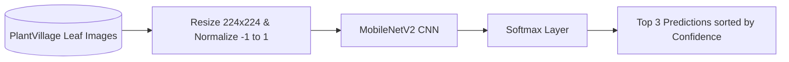

* **Dataset**: PlantVillage, containing 38 crop-disease leaf image classes.
* **Preprocessing**: Images are resized to $224 \times 224 \times 3$ pixels. Pixel values are scaled between -1 and 1 to match the expected inputs for the pre-trained ImageNet model.
* **MobileNetV2 Rationale**: Selected for its balance between performance and speed, allowing for real-time inference on standard CPU servers.
* **Evaluation Metrics**: Evaluated using accuracy, precision, recall, and F1-score computed by Scikit-Learn.

---

# 10. Logging Architecture

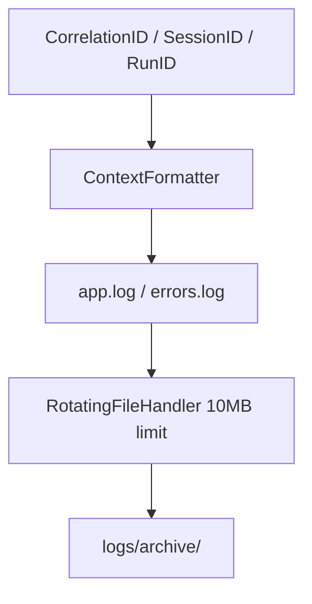

### Logs Directory Files
* **`logs/errors.log`**: Captures all warnings, errors, and critical logs across the application.
* **`logs/environment.log`**: Documents system settings, library versions, and CUDA/GPU availability at startup.
* **`logs/manifest.json`**: An audit trail tracking execution metrics for every run.
* **`logs/responses/`**: Saves copies of the pipeline's output JSON files.
* **`logs/gemini/`**: Saves the raw text payloads received from the Gemini API.

---

# 11. Configuration Management

Configuration is handled through environment variables and configuration files:

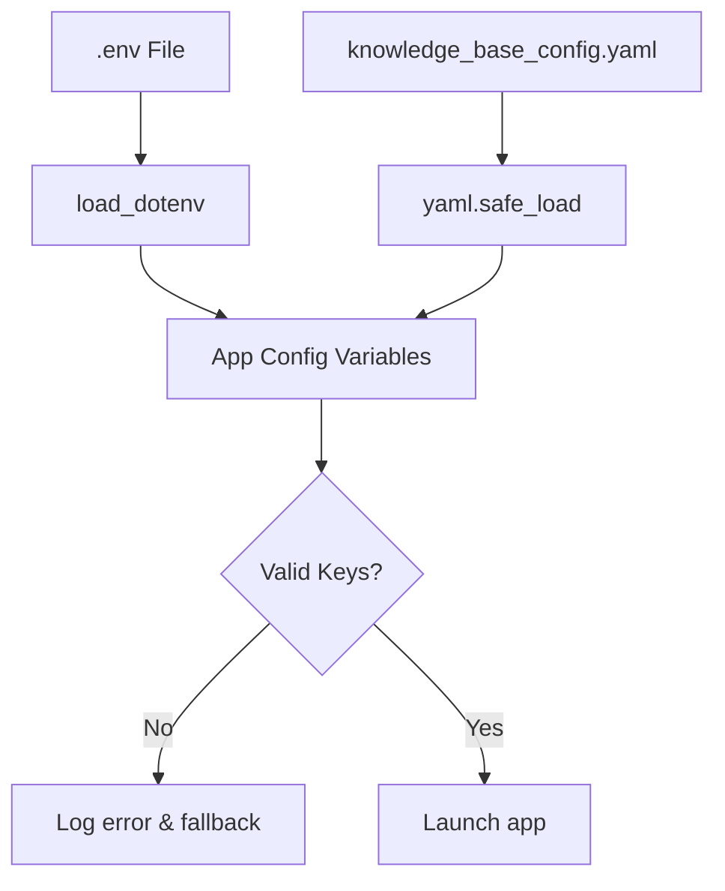

* **`.env`**: Stores the `GEMINI_API_KEY` credentials.
* **`knowledge_base_config.yaml`**: Lists supported crops and validation parameters.

---

# 12. Storage Architecture

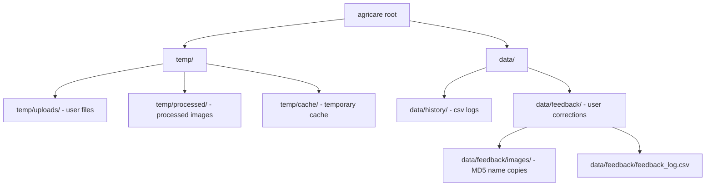

* **`temp/` Cleanup**: Temporary files are cleared automatically on startup if they are older than 24 hours.

---

# 13. Error Handling and Recovery

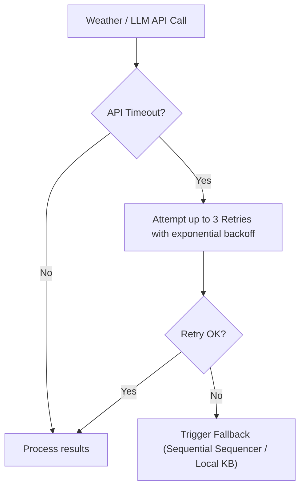

* **Weather API Failures**: Falls back to a default weather dictionary with the status `unavailable`, allowing the system risk calculations to continue.
* **LLM API Failures**: Automatically retrieves treatment and prevention records from the local JSON Knowledge Base.

---

# 14. External Services

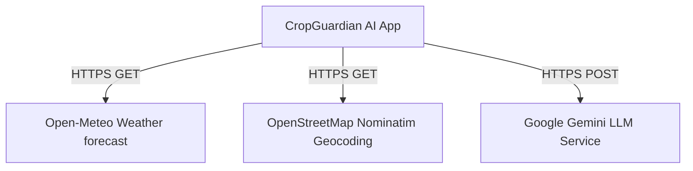

---

# 15. Presentation Preparation Notes

### 15.1. The O(1) Knowledge Base Cache
* **What is it?** A startup retrieval layer that reads, validates, and stores crop records in a thread-safe in-memory cache.
* **Why is it needed?** Speeds up database queries, lowering retrieval latency to less than 1 millisecond.
* **How does it work?** Reads crop JSON files, validates them against Pydantic schemas, and saves them in dictionaries keyed by class names.

### 15.2. ADK vs Legacy Coordinator
* **What is it?** A dual-orchestration setup using Google ADK with a Python fallback.
* **Why is it needed?** Protects against service disruptions, API rate limits, or missing credentials.
* **How does it work?** The ADK engine handles the primary workflow routing. If a connection issue or error is detected, the legacy sequencer takes over.

---

# 16. Viva and Interview Preparation

### Beginner Questions
1. **What is MobileNetV2 and why is it used?**
   * *Answer*: It is a lightweight convolutional neural network designed for mobile and edge devices. It uses depthwise separable convolutions to classify images with minimal CPU and memory usage.
2. **What is geocoding?**
   * *Answer*: The process of converting an address or city name into latitude and longitude coordinates.

### Intermediate Questions
1. **Explain the 4-stage resolution strategy in `ClassMapper`.**
   * *Answer*: 1. Exact match against database records. 2. Case-insensitive match. 3. Explicit mapping lookup for legacy classes. 4. Returns Not Found.
2. **How does the system calculate environmental propagation risks?**
   * *Answer*: Uses deterministic rules: fungal risk is triggered by humidity > 70%, bacterial risk by humidity > 80% and temperatures between 25-35°C, and heat stress by temperatures over 30°C.

### Advanced Questions
1. **Explain how ContextVars are used for request tracing in this project.**
   * *Answer*: Python's `contextvars` module stores correlation, session, and run IDs. These variables are attached to log formatters, allowing the system to track individual requests across different files and agents.
2. **What design patterns are used in the core services layer?**
   * *Answer*: 1. Registry/Cache pattern for database records. 2. Adapter pattern for ADK tools. 3. Strategy/Fallback pattern for dual coordination.

---

# 17. Presentation Cheat Sheet

### Elevator Pitch (30 Seconds)
"CropGuardian AI is a multi-agent agricultural diagnostic platform. By combining a lightweight MobileNetV2 CNN with real-time weather data and Gemini LLM agents, it delivers actionable, weather-aware disease treatment plans to farmers in seconds—complete with local fallback capabilities for offline use."

### 2-Minute Explanation
* **Introduction**: Crop diseases threaten food security. CropGuardian AI offers quick, accessible diagnostics.
* **Process**: The user uploads a photo of an affected leaf. The MobileNetV2 model identifies the disease, the system fetches local weather details, calculations assess the spread risk, and the Gemini API generates a tailored treatment plan.
* **Key Strengths**: It uses a dual-orchestration pipeline (ADK and Legacy) with local fallback databases, and features an active learning feedback loop to collect retraining data.

### Technical Defense Notes
* *Criticism*: "Why not use a larger model like ResNet?"
  * *Response*: MobileNetV2 has a small footprint, enabling fast, real-time inference on cheap CPU-only servers.
* *Criticism*: "What happens if there's no internet connection?"
  * *Response*: The system uses a local JSON Knowledge Base as a fallback, allowing it to generate treatment and prevention advice without calling external APIs.
