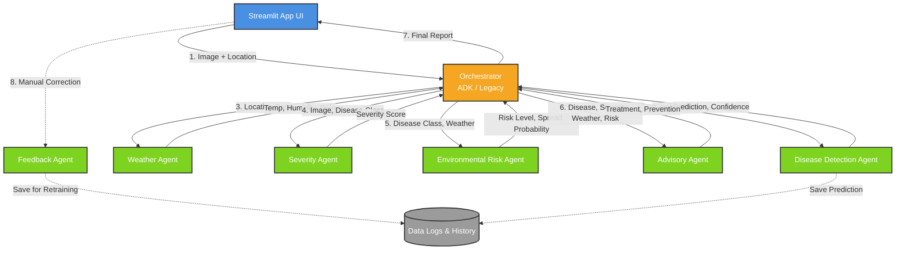

# 🌿 CropGuardian AI

**CropGuardian AI** is an intelligent, multi-agent agricultural system built to assist farmers and agronomists in detecting crop diseases, assessing environmental risks, and generating actionable agricultural advice. It provides an end-to-end pipeline that combines computer vision for disease detection with environmental intelligence to offer comprehensive crop management strategies.

---

## 📑 Table of Contents
1. [Overview](#overview)
2. [Key Features](#key-features)
3. [System Architecture & Pipeline](#system-architecture--pipeline)
4. [Agent Ecosystem](#agent-ecosystem)
5. [Orchestration Engines](#orchestration-engines)
6. [Getting Started](#getting-started)
7. [Project Structure](#project-structure)

---

## 🎯 Overview

CropGuardian AI is a robust MVP application developed with Streamlit. It leverages a multi-agent workflow to process crop images and farm locations to provide holistic insights. Rather than simply identifying a disease, it evaluates the severity of the infection, incorporates real-time local weather data, assesses the risk of the disease spreading, and finally compiles a tailored advisory report.

---

## ✨ Key Features

*   **Real-time Disease Detection:** Upload crop images for immediate classification and confidence scoring.
*   **Environmental Intelligence:** Integrates real-time weather data (temperature, humidity, precipitation, wind speed) based on farm location.
*   **Risk & Severity Assessment:** Calculates disease severity and the environmental risk of further spread.
*   **Actionable Advisory:** Generates expert-level advice on treatments, prevention, and fertilizer recommendations tailored to the specific disease and weather conditions.
*   **Continuous Improvement:** A built-in feedback loop allows users to correct misclassifications. Misclassified images are securely logged for future model retraining.
*   **Model Insights & History:** View past predictions and track comprehensive model performance analytics through the Evaluation Pipeline.

---

## 🏗 System Architecture & Pipeline

The system is designed around a multi-agent architecture where specialized agents handle distinct parts of the analysis. The pipeline is orchestrated sequentially to gather all necessary context before generating the final advisory.



### The Workflow Pipeline
1.  **Input:** The user provides an image of a crop leaf and the farm's location (City/State or Lat/Lon).
2.  **Detection:** The image is processed by the **Disease Detection Agent** to identify the plant species and disease.
3.  **Weather Context:** Simultaneously, the **Weather Agent** fetches current meteorological data for the provided location.
4.  **Severity Analysis:** The **Severity Agent** examines the image and the predicted disease to determine the extent of the damage (e.g., Low, Medium, High).
5.  **Risk Assessment:** The **Environmental Risk Agent** evaluates the weather conditions against the disease profile to calculate the risk of an outbreak or rapid spread (e.g., fungal diseases spread faster in high humidity).
6.  **Advisory:** The **Advisory Agent** aggregates all this context to formulate a comprehensive action plan.
7.  **Output & Feedback:** The user receives a detailed dashboard. If the prediction is incorrect, the user can submit feedback via the **Feedback Agent**.

---

## 🤖 Agent Ecosystem

CropGuardian AI uses specialized modules (Agents) for separation of concerns:

*   **`DiseaseDetectionAgent`**: Core computer vision model handler. Identifies the crop disease and returns top predictions with confidence levels.
*   **`WeatherAgent`**: Handles geocoding and interacts with weather APIs to retrieve real-time climate conditions.
*   **`SeverityAgent`**: Analyzes visual symptoms and disease characteristics to provide a qualitative and quantitative severity score.
*   **`EnvironmentalRiskAgent`**: A rules/logic engine that assesses the likelihood of disease propagation based on environmental factors (fungal risk, bacterial risk, heat stress).
*   **`AdvisoryAgent`**: The agricultural expert module. It synthesizes all inputs to provide treatments, preventative measures, and fertilizer tips.
*   **`FeedbackAgent`**: Manages the data pipeline for active learning. It securely logs misclassified images and correct labels to a structured dataset (`data/history/`).

---

## ⚙️ Orchestration Engines

The pipeline can be executed using one of two orchestrators, selectable from the UI:

1.  **Google ADK Workflow (`ADKCoordinatorAgent`)**
    *   Utilizes the Google Agent Development Kit (ADK).
    *   Agents are powered by `gemini-2.5-flash` acting as intelligent routers to specific tools.
    *   Features a robust, automatic fallback mechanism. If ADK is unavailable or API keys are missing, it safely falls back to the legacy orchestrator.
2.  **Legacy Coordinator (`CoordinatorAgent`)**
    *   A standard Python-based sequential orchestrator.
    *   Handles errors gracefully, ensuring that a failure in one agent (e.g., Weather API downtime) does not crash the entire pipeline (Partial Success mode).

---

## 🚀 Getting Started

### Prerequisites
*   Python 3.9+
*   Virtual Environment (recommended)
*   API Keys (e.g., Gemini API key for ADK workflows)

### Installation
1.  **Clone the repository and navigate to the root directory.**
2.  **Create and activate a virtual environment:**
    ```bash
    python -m venv venv
    source venv/bin/activate  # On Windows: venv\Scripts\activate
    ```
3.  **Install dependencies:**
    ```bash
    pip install -r requirements.txt
    ```
4.  **Environment Variables:** Create a `.env` file in the root directory and add required API keys:
    ```env
    GEMINI_API_KEY=your_gemini_api_key_here
    # Add other necessary API keys for Weather etc.
    ```

### Running the App
Start the Streamlit application using:
```bash
streamlit run app/main.py
```

---

## 📁 Project Structure

```text
agricare/
├── agents/                     # Multi-Agent ecosystem
│   ├── adk_workflow/           # Google ADK orchestration & tools
│   ├── advisory_agent/         # Advisory generation module
│   ├── coordinator_agent/      # Legacy sequential orchestrator
│   ├── disease_detection_agent/# Computer vision/prediction module
│   ├── environmental_risk_agent/# Risk assessment logic
│   ├── feedback_agent/         # Active learning feedback loop
│   ├── severity_agent/         # Severity scoring module
│   └── weather_agent/          # Weather API integrations
├── app/                        # Streamlit Web Application
│   ├── main.py                 # App entry point
│   └── pages/                  # Streamlit pages (Detection, Feedback, History, Insights)
├── data/                       # Local data storage (history, feedback logs)
├── mcp_server/                 # Model Context Protocol integrations
├── src/                        # Core source code
│   └── evaluation/             # Model evaluation and metrics scripts
├── tests/                      # Unit and integration tests
├── requirements.txt            # Python dependencies
└── README.md                   # This documentation
```
